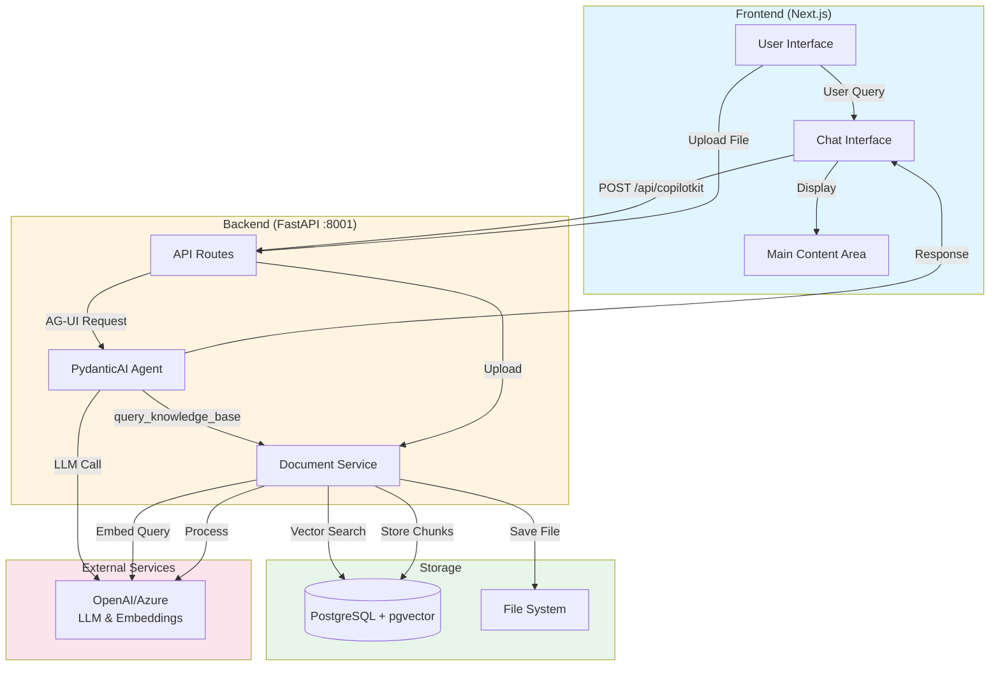
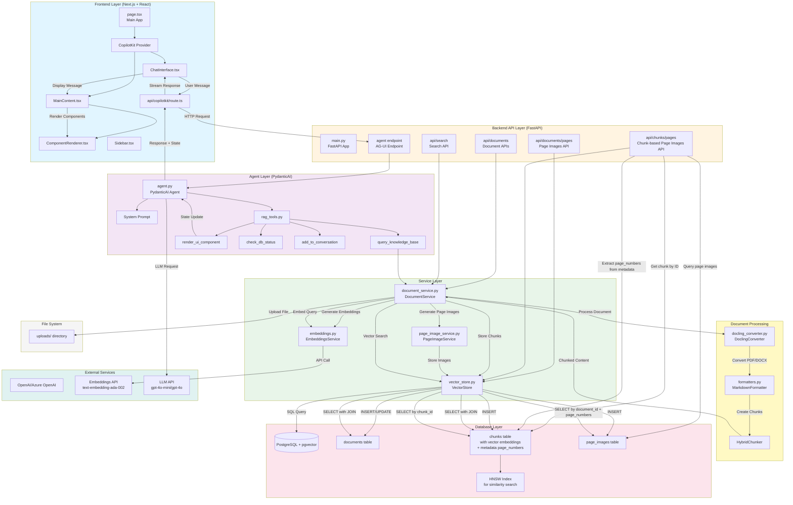

# System Flow Diagrams

## 1. Simple Flow (High-Level Overview)

## 2. Detailed Flow (Complete System Architecture)

## Key Workflows

### Document Upload & Processing Flow
1. User uploads file → `POST /api/documents/upload`
2. `DocumentService.upload_file()` saves to `uploads/`
3. Generate `document_id` (MD5 hash)
4. Register in `documents` table
5. `process_document()`:
   - `DoclingConverter` converts PDF/DOCX → Markdown
   - `MarkdownFormatter` + `HybridChunker` creates chunks
   - Chunks include `page_numbers` in metadata (from document provenance)
   - `EmbeddingsService` generates embeddings via OpenAI
   - `VectorStore.add_chunks()` stores in `chunks` table (with metadata containing `page_numbers`)
   - `PageImageService` generates PDF page images (if PDF)
   - `VectorStore.add_page_images()` stores in `page_images` table
6. Update document status to `'processed'`

### Chat Query & RAG Flow
1. User sends message → `ChatInterface`
2. CopilotKit → `POST /api/copilotkit` → `HttpAgent` → `/agent`
3. `PydanticAI Agent` receives query
4. Agent calls `query_knowledge_base(query, top_k)` tool
5. Tool → `DocumentService.search()`:
   - Embed query via `EmbeddingsService`
   - `VectorStore.search()` performs cosine similarity search
   - PostgreSQL query with HNSW index
   - Returns top-k chunks with similarity scores, `document_id`, and `metadata` (including `page_numbers`)
6. Agent processes results and calls `render_ui_component()` if needed
7. Agent generates response using LLM with RAG context
8. Response streamed back through layers
9. Frontend displays message + UI components

### Page Image Query Flow (Chunk-based)
1. Frontend receives chunk data from RAG query (includes `chunk_id` or chunk metadata)
2. To fetch page images for a specific chunk:
   - Option A: `GET /api/chunks/{chunk_id}/pages/images`
     - `VectorStore.get_page_images_by_chunk_id(chunk_id)`:
       - Queries `chunks` table to get `document_id` and `metadata->page_numbers`
       - Queries `page_images` table using `document_id` and `page_numbers`
       - Returns page images for those specific pages
   - Option B: `POST /api/documents/{document_id}/pages/images` (with `page_numbers` from chunk metadata)
     - `VectorStore.get_page_images_for_pages(document_id, page_numbers)`
     - Direct query using known `document_id` and `page_numbers`
3. Page images returned as Base64-encoded PNG data
4. Frontend displays page previews in `PagePreviewDisplay` component

### UI Component Rendering Flow
1. Agent calls `render_ui_component(component_type, data)`
2. Updates `RAGState.active_ui_components`
3. State snapshot sent to frontend
4. `MainContent` receives state via `useCoAgent()`
5. `ComponentRenderer` renders appropriate component:
   - `ListDisplay` for lists
   - `TableDisplay` for tables
   - `ImageDisplay` for images
   - `PagePreviewDisplay` for PDF page previews
6. For `PagePreviewDisplay`:
   - If `chunk_id` is available: fetches from `/api/chunks/{chunk_id}/pages/images`
   - Otherwise: fetches from `/api/documents/{document_id}/pages/images` with `page_numbers` from chunk metadata
7. Component displays page images with navigation controls

## Page Image Query Methods

### Available Query Methods

1. **By Document ID and Page Numbers** (`get_page_images_for_pages`)
   - Endpoint: `POST /api/documents/{document_id}/pages/images`
   - Method: `VectorStore.get_page_images_for_pages(document_id, page_numbers)`
   - Use case: When you know the document and specific page numbers

2. **By Chunk ID** (`get_page_images_by_chunk_id`) ⭐ **NEW**
   - Endpoint: `GET /api/chunks/{chunk_id}/pages/images`
   - Method: `VectorStore.get_page_images_by_chunk_id(chunk_id)`
   - Use case: When you have a chunk ID from RAG search results
   - Process:
     1. Query `chunks` table to get `document_id` and `metadata->page_numbers`
     2. Query `page_images` table using retrieved `document_id` and `page_numbers`
     3. Return matching page images

3. **Single Page by Document ID** (`get_page_image`)
   - Endpoint: `GET /api/documents/{document_id}/pages/{page_number}/image`
   - Method: `VectorStore.get_page_image(document_id, page_number)`
   - Use case: Fetching a single specific page

## Data Flow Summary

**Ingestion**: File/URL → Docling → Chunking (with page_numbers in metadata) → Embedding → PostgreSQL  
**Query**: User Question → Agent → Tool → Vector Search → Context (chunks with page_numbers) → LLM → Response  
**Page Images**: Chunk ID → Query chunks table → Extract page_numbers → Query page_images table → Return images  
**Storage**: PostgreSQL with pgvector extension for similarity search  
**UI**: Agent State → Frontend → Component Rendering → Page Image Query (by chunk_id) → User Display
