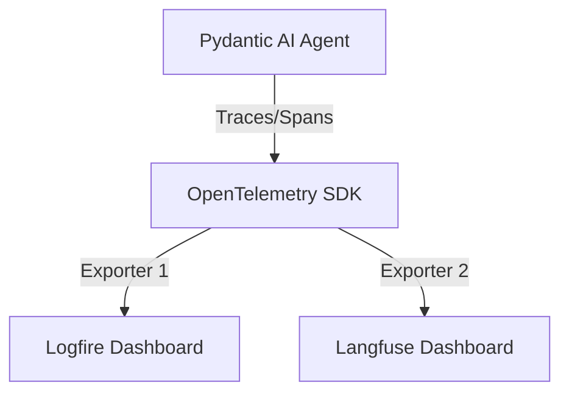

# Logfire vs. Langfuse Comparison

This document provides a comparison between Logfire and Langfuse in the context of this project.

## Overview

| Feature | Logfire | Langfuse |
|---------|---------|----------|
| **Core Focus** | Pydantic-first debugging and structured logging | LLM observability, evaluations, and prompt management |
| **Pydantic AI Integration** | Native, deep integration (direct from Pydantic authors) | Native via OpenTelemetry GenAI conventions |
| **Tracing** | Rich structured logs + spans | LLM-specific trace visualization (inputs/outputs/usage) |
| **Prompt Management** | Basic (via code) | Advanced (Prompt Registry in UI) |
| **Evaluations** | Basic | Advanced (Built-in eval framework, human annotators) |
| **Cost** | Part of Pydantic ecosystem | Open-source (self-host) or Cloud (generous free tier) |

## Implementation in this Project

### Dual-Exporting Strategy
We have implemented a dual-exporting strategy using **OpenTelemetry**. 
- **Logfire** initializes the primary OpenTelemetry pipeline.
- **Langfuse** is added as an additional `SpanProcessor`.

### Observations

1. **Logfire Strengths**:
   - Incredible for debugging Python object state and validation issues.
   - Feels "invisible" when using Pydantic AI.
   - Great "live" tail of logs.

2. **Langfuse Strengths**:
   - Better for specialized LLM metrics (latencies, token costs per provider).
   - "Conversation" view is often cleaner for multi-turn agent interactions.
   - Ability to "tag" traces for experimental tracking or user feedback.

## Recommendation

- Use **Logfire** for backend debugging, performance monitoring of non-LLM code, and Pydantic validation errors.
- Use **Langfuse** for LLM analysis, prompt iteration, and tracking costs/quality of the agent's responses.

Both tools can (and should) coexist during the development and evaluation phases.
