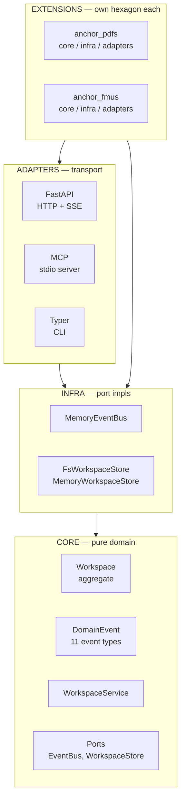

# Architecture

## Thesis

Anchor is a **canvas primitive** with **swappable extensions**. The
canvas is a small, domain-agnostic piece of software that knows about
nodes, edges, workspaces, and events. Everything that turns a PDF into
something you can drag onto that canvas — Docling extraction, vision-LM
region detection, region cropping, FMU inspection — lives in an
**extension**, sits behind a stable contract, and can be replaced
without touching the canvas.

The contract has a name: the **Open Ingestion Protocol** (OIP). It's
versioned separately and lives in its own
[repository](https://github.com/Novia-RDI-Seafaring/OIP).

A canvas with no extensions is empty but functional. A canvas with two
extensions (PDFs, FMUs) is what we ship today. A canvas with someone
else's extension (audio transcripts, code regions, video frames) is
why OIP exists.

```mermaid
flowchart LR
    subgraph durable["DURABLE on disk"]
        DOCS["DOCUMENTS<br/>per producer<br/>data/&lt;producer&gt;/..."]
        CAN["CANVASES<br/>per workspace<br/>data/canvases/&lt;slug&gt;/"]
    end
    subgraph ephemeral["EPHEMERAL in process"]
        BUS["EVENT BUS<br/>in-memory pub/sub"]
    end
    INGEST["IngestService<br/>extension"]
    WS["WorkspaceService<br/>core"]
    DOCS -.reads.-> INGEST
    INGEST -.writes.-> DOCS
    INGEST -- "DocIngested,<br/>IngestProgress" --> BUS
    WS -- "NodeAdded,<br/>EdgeAdded, ..." --> BUS
    CAN -.events.jsonl.-> WS
    WS -.snapshot.json.-> CAN
    BUS --> HTTP["HTTP/SSE<br/>web UI"]
    BUS --> MCP["MCP stdio<br/>agents"]
    BUS --> CLI["CLI<br/>scripts"]
```

*Three substrates — durable documents, durable canvases, ephemeral
session. Two services sit between them. Four consumer protocols attach
to the same event bus, so a human dragging a node and an agent making a
tool call drive the same code path.*

---

## The three substrates

| Substrate     | Lifetime                | Where it lives             | Owned by             |
| ------------- | ----------------------- | -------------------------- | -------------------- |
| **Documents** | durable, shared         | `data/<producer>/...`      | producer extensions  |
| **Canvases**  | durable, per-workspace  | `data/canvases/<slug>/`    | canvas core          |
| **Session**   | ephemeral, per-process  | in-memory event bus        | canvas core          |

Documents and canvases are **independent**. The same PDF can appear on
many canvases; deleting a canvas doesn't delete the PDF; a fresh
clone of `data/` on another machine yields the same canvases and the
same documents because everything is plain files.

The session substrate is the live wire — every mutation publishes a
`DomainEvent`, and the HTTP, MCP, and SSE adapters all subscribe to it.
That's how a node-move in one browser tab shows up in a second tab and
in an agent's MCP view within ~50ms, with no separate sync layer.

---

## The hexagon

Anchor's Python package follows ports-and-adapters layering, enforced
in CI by `import-linter`. The contracts (verbatim from `.importlinter`):

```
adapters → infra → core              (one direction only)

core MUST NOT import:                fastapi, openai, mcp, pymupdf,
                                     docling, uvicorn, starlette,
                                     typer, aiofiles, sse_starlette

infra MUST NOT import:               fastapi, mcp, uvicorn, starlette,
                                     typer, sse_starlette

core, infra MUST NOT import:         anchor.extensions.*
```

In English: **the canvas core is pure**. It knows the shape of a
workspace and how to apply an event to one; it cannot open a file, hit
a URL, or call an LLM. Concrete I/O lives in `infra/`. Transport — HTTP
routes, MCP tool definitions, CLI subcommands — lives in `adapters/`.
Anything PDF- or FMU-specific lives in `extensions/` and the canvas
itself does not import it.



*Layered structure. The arrows point in the only direction imports are
allowed. The core is pure domain — five contracts in `.importlinter`
fail the build if anyone reaches across a boundary or pulls a transport
or vendor SDK into a place it doesn't belong. Extensions repeat the same
shape inside their own boundary.*

### What lives in each layer

| Layer        | Path                              | Examples |
| ------------ | --------------------------------- | -------- |
| `core`       | `src/anchor/core/`                | `Workspace`, `DomainEvent`, `WorkspaceService`, port protocols |
| `infra`      | `src/anchor/infra/`               | `MemoryEventBus`, `FsWorkspaceStore`, `MemoryWorkspaceStore` |
| `adapters`   | `src/anchor/adapters/`            | FastAPI routers, MCP tool handlers, Typer CLI |
| `extensions` | `src/anchor/extensions/anchor_*/` | PDF medallion pipeline, FMU inspector |

Extensions repeat the same shape inside their own boundary — every
extension has its own `core/`, `infra/`, and (optionally) `adapters/`.
The fifth import-linter contract enforces this for `anchor_pdfs`.

---

## Two services

The whole canvas behaviour fits into one service plus extensions can
add their own. Today there are two:

- **`WorkspaceService`** *(core)* — the only thing allowed to mutate a
  workspace. Validates a command against current state, applies the
  event reducer, persists, publishes. Methods: `add_node`, `move_node`,
  `update_node`, `remove_node` (cascades to edges), `add_edge`,
  `remove_edge`, `clear`, `create_workspace`, `list_workspaces`,
  `get_state`. ~13 public methods, every one of them async, every one
  of them returning the new state plus the event(s) that produced it.

- **`IngestService`** *(extension: anchor_pdfs)* — runs a PDF through
  bronze (raw) → silver (Docling extraction) → gold (VLM-polished
  markdown + region detection). Emits progress events on the same bus.

Anchor-fmus has its own `FmuService` (`upload_and_inspect`,
`simulate`, `list_simulations`, ...). Anchor's canvas core never
imports either.

---

## Four ways to talk to it

| Protocol        | Use case                  | Entry point                    |
| --------------- | ------------------------- | ------------------------------ |
| **HTTP REST**   | the React web UI          | `GET/POST /api/workspaces/...` |
| **SSE**         | live updates to clients   | `GET /api/workspaces/{slug}/events` |
| **MCP (stdio)** | agents (Claude, Cursor)   | `anchor-mcp` binary            |
| **CLI**         | scripts, headless ingest  | `anchor` binary                |

All four end up calling the same `WorkspaceService` methods. There is
no second copy of the business logic. An agent moving a node and a
human dragging a node go through the same code path, hit the same
event log, and notify the same SSE subscribers.

The MCP server hosts both canvas tools (9: `canvas_get_state`,
`canvas_add_node`, ...) and extension tools (5 for PDFs, 6 for FMUs).
The extension tools are namespaced (`pdf.ingest_pdf`, `fmu.simulate`)
so they can coexist with anyone else's OIP-compliant tools.

---

## What ships in v2

- **Python package** `anchor` — one wheel, three binaries: `anchor`
  (CLI), `anchor-mcp` (stdio MCP server), `python -m anchor` (module
  entry).
- **React frontend** in `web/` — Vite + React 19 + Tailwind v4 +
  ReactFlow + Zustand + TanStack Query. Compiled into the same wheel
  via `web/dist/`. Same-origin in production, no separate API server.
- **Two extensions in-tree** — `anchor_pdfs`, `anchor_fmus`. Both ship
  OIP manifests. Both are reachable through the same MCP server.
- **Hexagonal layering enforced in CI** — `uv run lint-imports` passes
  five contracts on every push.

---

## What's intentionally not here

- **No auth.** Single-tenant, runs on your laptop. Multi-tenant is on
  the roadmap (see memory note `project_multitenancy_roadmap`).
- **No managed service.** No DB. No Redis. No queue. The substrate is
  the filesystem; the bus is in-process. Two browser tabs sync via SSE
  on a single Python process.
- **No vendor SDK in the canvas.** OpenAI imports live in
  `anchor_pdfs.infra.llm`. Swap them; the canvas doesn't notice.
- **No "knowledge graph" abstraction.** The graph is just nodes and
  edges. Provenance lives in the regions on disk, not in a separate
  triplestore.
