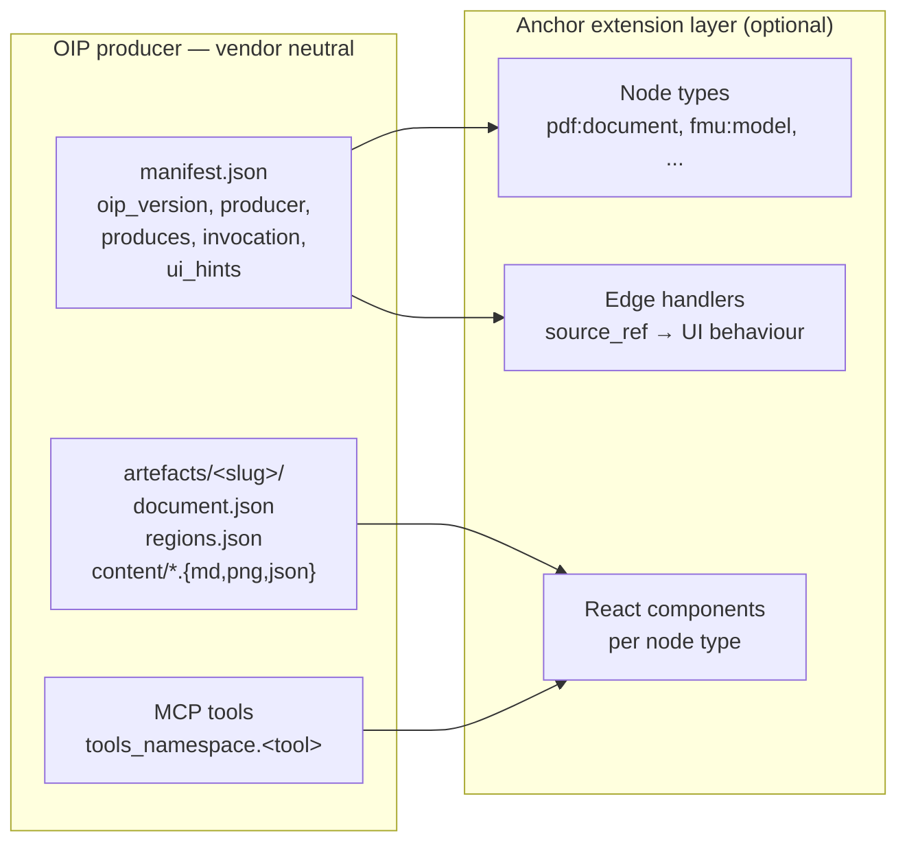

# Extensions and OIP

## Two layers of contract

Anchor draws a deliberate line:

- **Anchor-level extensions** are Python packages that share Anchor's
  process, register node types, edge styles, and MCP tools, and can
  reach into canvas internals when they have to. They follow the
  contract in [`v2/EXTENSIONS.md`](../EXTENSIONS.md). `anchor_pdfs` and
  `anchor_fmus` are this kind of extension. They ship in-tree today;
  out-of-tree is supported but not yet needed.

- **OIP producers** are anything that ingests source material into a
  region-of-interest layout that any consumer (Anchor, but also others)
  can attach to. They speak a vendor-neutral on-disk shape and an
  MCP-stdio invocation contract. They don't import Anchor; Anchor
  doesn't import them. Discovery happens through a manifest file at a
  known path.

Every Anchor extension *is* an OIP producer (it ships a manifest and
writes OIP-shaped artefacts). Not every OIP producer is an Anchor
extension. That's the whole point.



*An OIP producer is three things: a manifest, an on-disk artefact shape,
and a set of MCP tools. Anchor extensions add canvas-side hooks (node
types, edge handlers, React components) on top of that — but those hooks
are advisory. Another OIP consumer can render the same artefacts
differently.*

---

## The OIP manifest

A producer drops a single JSON file at a discoverable path. The file
declares what the producer ingests, what it produces, and how a
consumer invokes it. Verbatim from `anchor_fmus`:

```json
{
  "oip_version": "0.1",
  "producer": {
    "name": "anchor-fmus",
    "display_name": "Anchor FMUs",
    "version": "0.2.0",
    "homepage": "https://github.com/Novia-RDI-Seafaring/anchor-kb-ui-RAG"
  },
  "kind": "bundled-in-tree",
  "data_dir": "/.../data",
  "produces": {
    "source_kinds": ["application/x-fmu"],
    "region_kinds": ["fmu_variable", "fmu_parameter",
                     "simulation_result", "plot"],
    "source_ref_kinds": ["fmu-variable", "fmu-simulation-time"]
  },
  "invocation": {
    "kind": "mcp-stdio",
    "command": "anchor-mcp",
    "args": [],
    "tools_namespace": "fmu"
  },
  "ui_hints": {
    "node_types": [
      {"name": "fmu:model", "renders": "card with input/output handles + parameters"},
      {"name": "fmu:variable", "renders": "single-variable badge with current value"},
      {"name": "fmu:plot", "renders": "Recharts line plot of selected variables"}
    ],
    "edge_styles": {"fmu:wires": {"stroke": "#0EA5E9", "dasharray": "0"}},
    "source_ref_handlers": {
      "fmu-variable": "open the FMU model node, highlight that variable",
      "fmu-simulation-time": "open the plot node, scrub to that time"
    }
  }
}
```

Three fields do most of the work:

- **`source_kinds`** — what MIME types this producer accepts. A
  consumer routes a dropped file to the producer that claims its kind.
- **`region_kinds`** — the names of the structured regions the
  producer emits. A consumer renders them differently per kind.
- **`source_ref_kinds`** — the polymorphic "where did this come from"
  keys. `pdf-page-bbox` carries page + bounding box;
  `audio-timestamp` carries seconds; `fmu-variable` carries a variable
  name. Consumers route these to UI behaviours.

`ui_hints` is **advisory**. A consumer may render exactly what the
producer suggests, or substitute its own components. The producer
isn't shipping React; it's shipping intent.

---

## On-disk shape

A producer that has ingested anything writes:

```
data/
├── manifest.json                    ← matches the produced manifest
└── artefacts/
    └── <slug>/                      ← one folder per ingested document
        ├── document.json            ← title, source_kind, ingested_at, source_path?, size_units
        ├── regions.json             ← list of regions, each with id, kind,
        │                              source_ref, content paths
        └── content/                 ← payload — markdown, JSON, PNG, ...
            ├── <region-id>.md
            ├── <region-id>.png
            └── <region-id>.json
```

Every region has an `id` (`<slug>:r0042`), a `kind` (one of the
producer's declared `region_kinds`), a `source_ref` (one of the
producer's declared `source_ref_kinds`), and `content.{text|image|json}`
paths *relative to* `artefacts/<slug>/`.

The slug is **deterministic** — re-ingesting the same input gives the
same slug, so artefacts are content-addressable.

---

## What's in the in-tree extensions today

### `anchor_pdfs` — the PDF medallion

| Stage  | What it does                                        | Tool           |
| ------ | --------------------------------------------------- | -------------- |
| bronze | store raw PDF bytes                                 | `pdf.ingest_pdf` |
| silver | Docling extraction → page index, items, bboxes      | `pdf.get_document_index` |
| gold   | OpenAI vision polish + region extraction            | `pdf.get_gold_regions` |

Five MCP tools (`ingest_pdf`, `list_documents`, `get_document_index`,
`get_gold_regions`, `get_page_text`), namespaced `pdf.*`. Two node
types declared (`pdf:document`, `pdf:spec_table`). One source-ref kind
(`pdf-page-bbox`).

### `anchor_fmus` — FMU inspector + simulator

| Action               | Tool                                  |
| -------------------- | ------------------------------------- |
| inspect a fresh FMU  | `fmu.inspect`                         |
| list parsed models   | `fmu.list_models`                     |
| run simulation       | `fmu.simulate`                        |
| fetch result series  | `fmu.get_results`                     |

Six MCP tools, namespaced `fmu.*`. Three node types
(`fmu:model`, `fmu:variable`, `fmu:plot`). Two source-ref kinds
(`fmu-variable`, `fmu-simulation-time`). Falls back to a fake runtime
if FMPy isn't installed, so the demo works on any machine.

---

## Discovery — three places a consumer looks

When `anchor extensions list` runs, it walks (in order):

1. **Bundled in-tree** — manifests returned by Python entry-point
   functions like `anchor_fmus.extension.manifest()`. These are the
   extensions baked into Anchor's wheel.
2. **System-wide** — `${XDG_CONFIG_HOME:-~/.config}/oip/producers.d/*.json`.
   For producers a user installed once, available across projects.
3. **Per-project** — `<data-dir>/.oip/producers.d/*.json`. For
   producers a particular dataset depends on. These travel with the
   `data/` folder when it's copied or shared.

The same producer can appear in more than one place; the most specific
location wins (project > system > bundled).

A producer becomes discoverable by writing one file. Removing it is
deleting one file. There is no registry, no plugin manager, no
"please restart Anchor."

---

## What OIP is *not* for

- **Not a runtime.** OIP doesn't say how a producer extracts regions,
  what model it calls, or what library it uses. That's deliberately
  out of scope.
- **Not Anchor-specific.** A future RAG system, a Notion-like canvas,
  or an in-IDE assistant could consume the same producer outputs. The
  spec is at `github.com/Novia-RDI-Seafaring/OIP` and ships its own
  CLI (`uvx oip validate <data-dir>`).
- **Not a 1.0 promise.** OIP is `0.1`. The shape is settled enough to
  build on; specifics will move.

---

## The author's ladder

A producer goes through three states as it matures:

1. **Hardcoded.** Inline in the consumer's source. Quickest path to a
   demo, terrible for sharing. This is where `anchor_pdfs` started.
2. **Bundled extension.** Lives in `v2/src/anchor/extensions/`,
   ships in the same wheel, but is structurally separated and
   reachable through OIP. This is where the two extensions live today.
3. **External package.** Its own repo, `pip install your-tool`, drops
   a manifest into `~/.config/oip/producers.d/` on install. Anchor (or
   anyone else) picks it up at next start. This is the shape OIP is
   designed for; it's also the shape we haven't shipped a third-party
   example of yet.

The ladder is one-directional: extensions can move outward but can't
move inward without losing the property of being independent. The
hexagonal layering is what makes the move from step 2 to step 3
mechanical instead of architectural.

---

## Future direction — parametric CAD as a producer

Parametric CAD is one of the strongest fits for OIP because the
producer's regions *are parameters*, and the canvas already speaks
parameters (a spec table is a parameter set). Wiring a spec-table row
to a CAD parameter via `source_ref` closes the loop on
*"the datasheet drives the geometry."*

A future `anchor-cad` (or vendor-neutral `oip-cad`) producer would
declare:

```json
{
  "produces": {
    "source_kinds":     ["application/x-jscad",
                         "application/step+xml",
                         "application/vnd.cadquery"],
    "region_kinds":     ["parameter", "feature", "part",
                         "assembly", "dimension", "joint", "view_state"],
    "source_ref_kinds": ["cad-parameter-name", "cad-feature-id",
                         "cad-assembly-path", "cad-face-id"]
  }
}
```

A `parameter` region is `{name, value, unit, min, max, default}`.
A `view_state` region is just another parameter set targeting the
renderer (`exploded_factor`, `section_plane`, ...) — exploded views
become "the same model with view_state parameters set differently,"
no special-casing.

The agentic story:

1. Drop a parametric model file onto the canvas.
2. Producer ingests, emits one region per parameter and feature.
3. Canvas renders a `cad:model` node — a 3D viewport, with parameter
   handles on its border.
4. Agent reads the LKH-5 leaflet's impeller-diameter spec, calls
   `cad.set_parameter` on the CAD model, calls `cad.set_view_state`
   for an exploded view. Geometry updates.
5. The chain motif lights up: *spec row → CAD parameter*, source_ref
   on both ends. Datasheet → geometry, with provenance both ways.

Web libraries that make this buildable today (in rough order of
ambition):

- **JSCAD** — JS-native parametric kernel, runs in-browser, exports
  glTF/STL. Cheapest path to a demo.
- **Manifold** — fast WASM CSG kernel, used by Google's 3MF/glTF
  pipeline. CSG-only, no full feature tree.
- **OpenCascade.js** — full B-Rep kernel in WASM, real CAD I/O
  including STEP. Heavyweight (~30MB bundle) but industry-grade.
- **CadQuery** — server-side Python, streams glTF to the browser.
  Heavier infrastructure, proper engineering CAD with constraints.

Display layer is `three.js` or `<model-viewer>` regardless of which
kernel produced the geometry. Not on any roadmap; written down as a
future direction whose plumbing the architecture already supports.

---

## Future direction — derivation chains

A producer can be both a **consumer** (it reads another producer's
artefacts) and a **producer** in its own right (it writes new artefacts
that descend from what it consumed). This is how OIP scales to
analytical work, not just ingestion.

**Worked example:** a pump-curve interpreter reads a region from a PDF
(produced by `anchor-pdfs`), traces the curve geometry into structured
data (axes, fitted functions, operating points), and emits its own OIP
artefacts. Those artefacts can then feed a parametric FMU model, which
itself feeds a simulation run. Each step is its own producer with its
own data dir:

```
anchor-pdfs            (raw PDF → spec_block regions)
   ↓ derived_from
anchor-chart-tracer    (region image → chart-axis, chart-curve, chart-fitted-function)
   ↓ derived_from
anchor-pump-curves     (chart-tracer artefact → pump operating points, NPSH curves)
   ↓ derived_from
anchor-fmus            (pump-curves → parametric simulation model)
   ↓ derived_from
anchor-simulations     (FMU + parameter sweep → time-series results)
```

The chain is honest, transparent, and traversable. A consumer chasing
provenance back to first principles walks `derived_from` until it's
null.

### Two small fields make the chain explicit

The OIP spec needs (or will, in v0.2) two additions, both on
`document.json`:

```json
{
  "derived_from": {
    "producer": "anchor-pdfs",
    "slug": "alfa-laval-lkh",
    "region_id": "alfa-laval-lkh:r0042"
  },
  "status": "draft"
}
```

- **`derived_from`** — pointer back at the parent artefact. Generic
  across producers. `null` for raw ingestion (PDFs, FMUs, source
  files).
- **`status`** — lifecycle: `draft` (provisional) → `approved` (committed,
  treated as ground truth) → optional `rejected` (kept for audit).
  Most pure-ingest producers stay at `approved`; analytical / AI-traced
  / collaboratively-authored producers benefit from the lifecycle.

### Generic before specific — keep producers narrow

The strongest scaling property is **per-layer specificity**. Resist
making a producer too domain-specific too early:

| Layer  | Generic                        | Domain-specific (follow-on)              |
| ------ | ------------------------------ | ---------------------------------------- |
| chart  | `anchor-chart-tracer`          | `anchor-pump-curves`, `anchor-material-curves`, `anchor-process-curves` |
| image  | `anchor-image-vision`          | `anchor-pid-tracer`, `anchor-er-diagram` |
| text   | `anchor-text-tracer`           | `anchor-sysml-extractor`, `anchor-spec-extractor` |
| 3d     | `anchor-cad`                   | `anchor-fasteners`, `anchor-piping-fittings` |

The hard work (geometry, vision, fitting) lives in the generic layer
and serves every domain. Domain interpreters are small (often a few
hundred LOC) and add tagging, validation, and unit awareness on top.

**Rule of thumb:** if you're tempted to call a producer
`anchor-<specific-thing>`, ask whether the underlying mechanism applies
to a *family* of similar things. If yes, ship the generic family
producer first; the domain interpreter is its first downstream
consumer.

### Architectural rules for the chain

- **Producers don't write into other producers' data dirs.** Each
  producer owns its own artefacts. Cross-producer references go
  through `derived_from`, never through filesystem mutation.
- **Drafts can derive from drafts.** A pump-curve draft can descend
  from a chart-tracer draft that descends from a still-being-traced
  PDF. The chain stays honest about confidence at each layer.
- **Approval is per-artefact.** When a draft transitions to approved,
  its parents stay at whatever status they had — promotion doesn't
  cascade.

---

## Future direction — interactive producers

Some producers — chart tracers, P&ID editors, SysML authors, anything
with click-driven authoring — aren't one-shot. They need a stateful
UI where humans (or agents in collaboration with humans) iteratively
build up the artefact. OIP supports this without inventing new
mechanism; the existing pieces compose.

### What an interactive producer ships

The same three OIP contracts as any producer, plus one lifecycle
convention:

1. **Manifest** — declares `source_kinds`, `region_kinds`,
   `source_ref_kinds` as usual.
2. **MCP tools** — at minimum: `start_session`, `commit`, `discard`.
   Optionally also incremental editing tools (`add_axis_calibration`,
   `add_curve_point`, `set_parameter`, ...).
3. **On-disk artefacts** — written under `status: draft` while the
   session is open; transitioned to `status: approved` on commit.
4. **Bus events** — the producer emits progress events on its MCP
   notifications channel as the session unfolds. Anchor (or any other
   consumer) subscribes and watches the artefact materialise live.

### The session lifecycle

```
agent / user calls   producer.start_session(source_region_id)
                  → producer creates artefact with status: draft
                  → producer emits SessionStarted on bus

user works in the producer's UI (clicks, traces, fills in fields)
                  → producer updates artefact incrementally
                  → producer emits RegionAdded / RegionUpdated events

user commits      → producer transitions status to: approved
                  → producer emits SessionCommitted

OR user discards  → producer deletes the draft (or marks rejected)
                  → producer emits SessionDiscarded
```

Anchor's canvas displays draft artefacts visibly (dashed border,
*draft* badge) so users know they're not yet ground truth. When the
artefact transitions to approved, the badge disappears and other
consumers (FMUs, simulators, agents reading provenance) can rely on
it.

### Where the producer's UI lives

Interactive producers usually have substantial UI (the existing
chart-tracer is a good example — click-on-axes, drag-along-curves,
fit-and-export). **The architecture doesn't require porting that UI
into Anchor.** Three options, in order of cost:

1. **Standalone app, file-export to OIP folder.** Cheapest. User
   opens the producer's app, does the work, hits export. Anchor
   ingests the resulting folder when it appears in the data dir.
2. **MCP-driven launch.** Anchor calls `start_session(...)`, the
   producer opens its own window. User works there. On commit, the
   producer writes the artefact and Anchor's library refreshes via
   the bus event. No UI integration; full feedback loop.
3. **Embedded UI inside Anchor's canvas.** The producer ships a Web
   Component (Lit, Stencil, vanilla custom element). Anchor's
   `cad:model`-style primitive renders the producer's element
   in-canvas. Most polished UX; highest packaging cost.

Most producers should start at level 1 or 2 and only embed when the
context-switch friction earns the integration work.

### Agents and humans as equal authors

The session lifecycle doesn't distinguish who calls the tools.
A human clicking through the producer's UI and an agent calling
`producer.add_curve_point(...)` over MCP go through the same code
path. **Agents authoring drafts and humans approving them is the
common collaborative pattern**; the architecture supports it without
special casing.

For agent-authored drafts that affect downstream artefacts (e.g., a
pump-curve trace that will feed an FMU parameter), the canvas should
require explicit human approval before the draft promotes to
approved. That's a UI policy on top of OIP's `status` field, not a
protocol mandate — different consumers can choose different policies.

### What's worth doing now vs deferring

**Now (cheap):** document the pattern. This section. Lets future
producer authors find the right shape without re-deriving it.

**When the first interactive producer integrates** (chart-tracer is
the candidate, in a separate repo today): walk it through the
[`oip` skill](https://github.com/Novia-RDI-Seafaring/OIP) and add
`start_session` / `commit` / `discard` to its existing CLI/UI.

**Defer:** OIP-spec-level "session" first-class concept. The
`status: draft` field plus partial-region updates already cover what
sessions need. If experience proves it ergonomically lacking,
v0.3 can grow a `session_id` field on regions.

---

## Future delight — the anchor-and-chain motif

A small visual idea worth keeping: every evidence edge in the canvas
connects a node to its `source_ref`. The project is called *Anchor* for
exactly that reason — every claim on the canvas is anchored to a region
of source material. A natural-but-deferred polish is to render those
edges with **a small anchor glyph at the source endpoint** and **a
chain-link pattern along the edge stroke**. The metaphor is already in
the codebase; the UI just doesn't lean into it yet. Not a roadmap item;
a Friday-afternoon thing for a later release.
