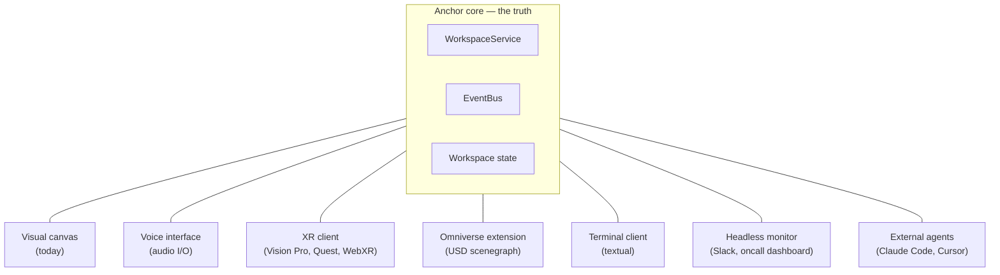

# Many interfaces, one truth

The visual canvas is one way to see a workspace. It's the most obvious
one, but it isn't privileged — it's a sibling of every other consumer
of the same event stream and command API. The architectural stance is:

> **The interface sits in front of the canvas with a hole through it.
> Both are siblings of the core; neither talks to the other directly.
> They co-exist on screen but depend only on the ground truth behind
> them.**

The metaphor matters because it's how new interfaces get built. You
don't extend the canvas to support voice; you write a voice interface
that subscribes to the same `/api/workspaces/{slug}/events` stream and
posts the same `POST /api/.../nodes` commands. The canvas doesn't know
the voice interface exists. The voice interface doesn't know the
canvas exists. They both project the same workspace state.

*Every interface is a sibling. Adding one doesn't change any of the
others. None of them have privileged access to core; they all use the
same HTTP / SSE / MCP surface.*

## The interface family

Each one is a real place the architecture invites you to go. None
is built today beyond the visual canvas; that's the point — they're
*enabled*, not *required*.

### Visual canvas (today)

ReactFlow + React 19 in `web/`. Built-in node types, runtime
extensible via `registerCardType`. Subscribes to SSE; mutates via HTTP.
[See 05-canvas.md](./05-canvas.md).

### In-browser agent dock (proposed)

No in-browser MCP dock is shipped today. External agents use the local
`anchor-mcp` stdio process; the browser uses the HTTP API and SSE event
stream. A future dock would need its own authenticated transport design.

### Voice / speech (accessibility, hands-free)

Subscribes to `/events`, narrates additions, removals, ingestions,
agent actions. Receives spoken commands, transcribes them, calls the
HTTP API. Editorial filtering lives in the voice interface itself —
not every `NodeMoved` is worth saying aloud. Useful for blind users,
hands-busy environments (workshop floor, lab bench), and as a parallel
modality alongside the visual canvas.

### Terminal / TUI

A headless interface for SSH and Claude Code-like environments.
Renders the workspace as an outline; commands are typed not clicked.
The same idempotency that makes optimistic UI work makes terminal
commands instantly visible to a parallel browser session.

### XR — augmented and virtual reality

Vision Pro (RealityKit), Meta Quest (Unity / Unreal), WebXR (three.js
in the browser). Renders nodes as floating panels, evidence edges as
literal chains in space. Most interestingly: nodes whose `source_ref`
points at a physical object render *next to that object* when the user
looks at it. The pump's flow-rate spec floats next to the actual pump.

The "Anchor" name becomes literal here. Today a node is anchored to a
PDF page bbox; tomorrow the same node is anchored to a real pump via
an ArUco marker, a QR code, or a world-anchor coordinate. The
`source_ref.kind` polymorphism handles it — a new kind, a new handler,
no protocol change.

### Omniverse / USD / digital twins

NVIDIA Omniverse runs on USD (Universal Scene Description). It maps
onto OIP cleanly in two directions:

- **As a producer.** A `anchor-usd` (or vendor-neutral `oip-usd`)
  producer reads a USD stage and emits regions per prim — assemblies,
  parts, materials, joints, physics constraints. `source_kinds:
  ["model/vnd.usdz"]`, `region_kinds: ["assembly", "part", ...]`,
  `source_ref_kinds: ["usd-prim-path"]`. A spec-table row points at
  `/World/Pump/Impeller/Blade_03` the same way it points at PDF page 2
  bbox today.
- **As a consumer.** An Omniverse Kit extension subscribes to the
  canvas event stream, projects nodes into a USD layer, mirrors
  spec-row → 3D-prim evidence edges as chain glyphs in the digital
  twin.

The same shape covers IFC (construction BIM), STEP (CAD interchange),
glTF (web 3D), CityGML (geospatial), Cesium 3D Tiles. Each is either a
producer (declares its `source_ref_kinds`) or a consumer (renders the
event stream), and OIP stays the glue that doesn't pick sides.

### Headless monitor

A process subscribed to SSE that does no rendering at all. Posts a
Slack message when an ingestion finishes. Rings the oncall pager when
an agent makes destructive changes. Writes to a metrics dashboard.
Records every event to a tape file for replay.

A monitor isn't really an interface in the human-facing sense, but
architecturally it's the same thing: another sibling subscribing to
the same stream. Building one is half a day's work because the
plumbing is already there.

### External agents

Claude Code, Cursor, anyone running an MCP client. They hit the same
MCP server at `anchor-mcp` (stdio) or the same SSE feed in-browser.
They've always been first-class consumers; calling them "external"
is just naming the architectural reality.

## What stays neutral, what becomes specific

The split between core and interface is what makes this work, and
it's worth being explicit about:

**Neutral (in core):**
- Workspace state — nodes, edges, parents, source refs
- Event types — `NodeAdded`, `NodeMoved`, `EdgeAdded`, etc.
- Source refs polymorphism — kind + payload, opaque to core
- Command API — `add_node`, `move_node`, `connect`, etc.

**Specific (in each interface):**
- How a node is rendered (card, voiced phrase, 3D panel, USD prim)
- How a source_ref is dispatched (open PDF, scrub audio, highlight a
  3D prim, point a Vision Pro camera)
- How input is captured (mouse, voice, gesture, keyboard, MCP tool call)
- What's worth surfacing (visual canvas shows everything; voice filters
  to "interesting" events; monitor only fires on ingestion completes)

If you ever feel pressure to put a rendering hint into core, you've
left the path. The core knows the *shape* of the data; each interface
knows its own *style* of expression.

## The XR test

The strongest test of whether the architecture is honest is whether a
blind user could use it. If the voice interface can fully describe and
fully drive the workspace from audio alone, then the visual canvas is
genuinely just one rendering — not the canonical one. Every other
interface follows from that.

The same test, restated for industry: *can a maintenance engineer
wearing a Vision Pro on the engine deck of a ship use Anchor without
ever opening a browser?* If yes, the architecture is ready for
industrial deployment. If no, the canvas has accumulated implicit
state that should have been in the workspace.

## What's possible vs what's built

Today, only the visual canvas exists. The voice interface, terminal
client, XR clients, Omniverse extension, USD producer, and headless
monitor are *enabled* by the architecture but not implemented.

That distinction matters for the poster. The strong claim is:

> Adding a new interface — voice, XR, Omniverse, an industrial
> dashboard, your own — does not modify the canvas, does not modify
> core, and does not require a coordinating release. It writes against
> the same HTTP, SSE, and MCP surface that the visual canvas uses
> today.

Don't claim more than that. The architecture earns the claim;
shipping the rendering is everyone else's problem and that's
deliberately the design.
