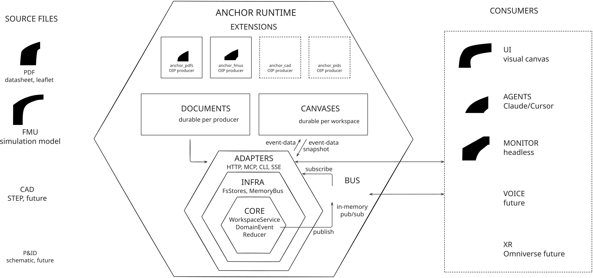

# Architecture

## Thesis

ANCHOR is a **canvas primitive** with **swappable extensions**. The
canvas is a small, domain-agnostic piece of software that knows about
nodes, edges, workspaces, and events. Everything that turns a PDF into
something you can drag onto that canvas — Docling extraction, vision-LM
region detection, region cropping, FMU inspection — lives in an
**extension**, sits behind a stable contract, and can be replaced
without touching the canvas.

The contract has a name: the **Open Ingestion Protocol** (OIP). It's
versioned separately and lives in its own
[repository](https://github.com/Novia-RDI-Seafaring/OIP).

A canvas with no extensions is empty but functional. A canvas with two
extensions (PDFs, FMUs) is what we ship today. A canvas with someone
else's extension (audio transcripts, code regions, video frames) is
why OIP exists.

The runtime, durable stores, event bus, consumers, and ports-and-adapters
layers are shown together in [The hexagon](#the-hexagon).

---

## Runtime composition

Each project is wired through `ProjectRuntime`, the shared composition
root for one resolved project config and data directory. It owns the
service instances that adapters should share: workspace service,
document store, event bus, ingest services, agent intents, and optional
extension services.

Bundled CAD, FMU, and SysML startup sits behind `ExtensionHost`. The host
returns the concrete runtime modules plus structured availability records, so
`ProjectRuntime` does not need to know each extension's builder interface.
Registered third-party OIP manifests remain external producer contracts and
are never imported as Python code.

HTTP, MCP, and CLI entry points ask for that runtime instead of each
building their own copies. This keeps adapter behaviour aligned: a
canvas mutation, PDF ingest, search, or intent operation reaches the
same stores and event bus no matter which interface started it. Tests
can still pass explicit services to the HTTP app when they need a small
isolated runtime.

Long-running HTTP and MCP processes build the full runtime. Short-lived
canvas-only CLI commands use the same builder with keyed PDF ingest and
optional extensions disabled. Listing or moving canvas nodes therefore
does not load Docling or an embedding model. Commands that ingest or
search documents request the full runtime and fail clearly if keyed PDF
ingest is unavailable. Extension-specific CLI commands ask `ExtensionHost` to
start only their selected CAD, FMU, or SysML module, so they share the bundled
builder path without paying to start unrelated runtimes.

---

## The three substrates

| Substrate     | Lifetime                | Where it lives             | Owned by             |
| ------------- | ----------------------- | -------------------------- | -------------------- |
| **Documents** | durable, shared         | `data/<producer>/...`      | producer extensions  |
| **Canvases**  | durable, per-workspace  | `data/canvases/<slug>/`    | canvas core          |
| **Session**   | ephemeral, per-process  | in-memory event bus        | canvas core          |

Documents and canvases are **independent**. The same PDF can appear on
many canvases; deleting a canvas doesn't delete the PDF; a fresh
clone of `data/` on another machine yields the same canvases and the
same documents because everything is plain files.

The session substrate is the live wire — every mutation publishes a
`DomainEvent`, and the HTTP, MCP, and SSE adapters all subscribe to it.
That's how a node-move in one browser tab shows up in a second tab and
in an agent's MCP view within ~50ms, with no separate sync layer.

---

## The hexagon

ANCHOR's Python package follows ports-and-adapters layering, enforced
in CI by `import-linter`. The contracts (verbatim from `.importlinter`):

```
adapters → infra → core              (one direction only)

core MUST NOT import:                fastapi, openai, mcp, pymupdf,
                                     docling, uvicorn, starlette,
                                     typer, aiofiles, sse_starlette

infra MUST NOT import:               fastapi, mcp, uvicorn, starlette,
                                     typer, sse_starlette

core, infra MUST NOT import:         anchor.extensions.*
```

In English: **the canvas core is pure**. It knows the shape of a
workspace and how to apply an event to one; it cannot open a file, hit
a URL, or call an LLM. Concrete I/O lives in `infra/`. Transport — HTTP
routes, MCP tool definitions, CLI subcommands — lives in `adapters/`.
Anything PDF- or FMU-specific lives in `extensions/` and the canvas
itself does not import it.



*The runtime separates source producers, durable document and canvas
stores, ports-and-adapters layers, and consumers. The core is pure
domain; `.importlinter` fails the build if code reaches across a
boundary or pulls a transport or vendor SDK into a place it does not
belong.*

### What lives in each layer

| Layer        | Path                              | Examples |
| ------------ | --------------------------------- | -------- |
| `core`       | `src/anchor/core/`                | `Workspace`, `DomainEvent`, `WorkspaceService`, port protocols |
| `infra`      | `src/anchor/infra/`               | `MemoryEventBus`, `FsWorkspaceStore`, `MemoryWorkspaceStore` |
| `adapters`   | `src/anchor/adapters/`            | FastAPI routers, MCP tool handlers, Typer CLI |
| `extensions` | `src/anchor/extensions/anchor_*/` | PDF medallion pipeline, FMU inspector |

Extensions repeat the same shape inside their own boundary — every
extension has its own `core/`, `infra/`, and (optionally) `adapters/`.
The fifth import-linter contract enforces this for `anchor_pdfs`.

---

## Two services

The whole canvas behaviour fits into one service plus extensions can
add their own. Today there are two:

- **`WorkspaceService`** *(core)* — the only thing allowed to mutate a
  workspace. Validates a command against current state, applies the
  event reducer, persists, publishes. Methods: `add_node`, `move_node`,
  `update_node`, `remove_node` (cascades to edges), `add_edge`,
  `remove_edge`, `clear`, `create_workspace`, `list_workspaces`,
  `get_state`. ~13 public methods, every one of them async, every one
  of them returning the new state plus the event(s) that produced it.

- **`IngestService`** *(extension: anchor_pdfs)* — runs a PDF through
  bronze (raw) → silver (Docling extraction) → gold (VLM-polished
  markdown + region detection). Emits progress events on the same bus.

`anchor_fmus` has its own `FmuService` (`upload_and_inspect`,
`simulate`, `list_simulations`, ...). ANCHOR's canvas core never
imports either.

### Region retrieval

PDF ingest writes bronze, silver, and gold artifacts. Silver is the
Docling view: page markdown, item metadata, bboxes, and table cells.
Gold is the agent-facing view: source regions with page, bbox, title,
description, tags, optional cells, and server-derived `content`.

That `content` is rendered by ANCHOR from the Docling items or table
cells selected by the region geometry. It is not submitted by the
agent. Search embeds region title, description, and content. In normal
use an agent should search gold regions and call `get_gold_regions` for
the matching region. Loading the whole page markdown remains a fallback
for ambiguous or missing region content.

---

## Four ways to talk to it

| Protocol        | Use case                  | Entry point                    |
| --------------- | ------------------------- | ------------------------------ |
| **HTTP REST**   | the React web UI          | `GET/POST /api/workspaces/...` |
| **SSE**         | live updates to clients   | `GET /api/workspaces/{slug}/events` |
| **MCP (stdio)** | agents (Claude, Cursor)   | `anchor-mcp` binary            |
| **CLI**         | scripts, headless ingest  | `anchor` binary                |

All four end up calling the same `WorkspaceService` methods. There is
no second copy of the business logic. An agent moving a node and a
human dragging a node go through the same code path, hit the same
event log, and notify the same SSE subscribers.

The shared `ProjectRuntime` keeps the surrounding services aligned too:
document store, ingest services, event bus, FMU/CAD/SysML services, and
intent queue. Adapter parity means adding an operation should expose
the same project-runtime operation through HTTP, MCP, and CLI unless
there is a documented reason not to.

The MCP server hosts both canvas tools (`canvas_get_state`,
`canvas_add_node`, ...) and extension tools for PDFs, FMUs, CAD and
SysML. Extension tool names use safe prefixes such as `ingest_pdf`,
`fmu_simulate` and `sysml_render` so they can coexist with other tools
and pass MCP client name validation.

Extension discovery and bundled runtime startup live in the
`anchor.adapters.extension_host` module. It reads bundled extension manifests,
exposes the public extension list and skill metadata, and starts bundled CAD,
FMU, and SysML modules without making `ProjectRuntime` know each builder
interface. Manifest discovery remains separate from third-party code loading:
a registered OIP manifest says what an external producer offers, but does not
authorize ANCHOR to import or execute arbitrary package code.

Bundled startup diagnostics use one shared payload across all adapters:
`anchor extensions status`, `GET /api/extensions/status`, and the MCP tool
`anchor_extension_status`. Each reports the same sorted records, availability
counts, failure reason, and error type.

---

## What ships in v2

- **Python package** `anchor` — one wheel, three binaries: `anchor`
  (CLI), `anchor-mcp` (stdio MCP server), `python -m anchor` (module
  entry).
- **React frontend** in `web/` — Vite + React 19 + Tailwind v4 +
  ReactFlow + Zustand + TanStack Query. Compiled into the same wheel
  via `web/dist/`. Same-origin in production, no separate API server.
- **Four extensions in-tree** - `anchor_pdfs`, `anchor_fmus`, `anchor_cad`,
  and `anchor_sysml`. All ship OIP manifests and are reachable through the
  same MCP server. SysML remains hidden from the public extension list while
  its text-to-canvas flow is experimental.
- **Hexagonal layering enforced in CI** - `uv run lint-imports` passes six
  contracts on every push.

---

## What's intentionally not here

- **No auth.** Single-tenant, runs on your laptop. Multi-tenant is on
  the roadmap (see memory note `project_multitenancy_roadmap`).
- **No managed service.** No DB. No Redis. No queue. The substrate is
  the filesystem; the bus is in-process. Two browser tabs sync via SSE
  on a single Python process.
- **No vendor SDK in the canvas.** OpenAI imports live in
  `anchor_pdfs.infra.llm`. Swap them; the canvas doesn't notice.
- **No "knowledge graph" abstraction.** The graph is just nodes and
  edges. Provenance lives in the regions on disk, not in a separate
  triplestore.
