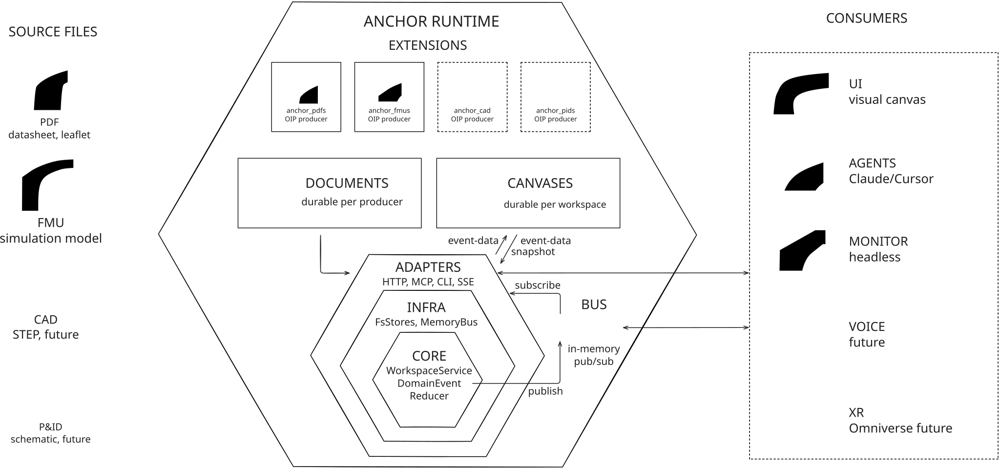

# Architecture

ANCHOR is a file-backed modular monolith with ports-and-adapters boundaries.
The shared domain model describes canvases, nodes, edges, intents, and review
operations. Extensions add PDF processing, CAD, SysML, and optional FMU services.

For application use, start with the [Quickstart](../getting-started/quickstart.md).
This page explains how the interfaces reach the same project state.

## Environment, project, and runtime

An environment selects the provider and model-egress policy. A project binds
one document corpus and its canvases to that environment. Project files live
under `.anchor_data/`; the environment registry maps a project name to its folder.

`ProjectRuntime` composes services for one resolved project. It supplies the
workspace service, stores, event bus, intent service, and relevant extension
services. Runtime profiles (`canvas`, `ingest`, `extensions`, and `full`) allow
short-lived commands to avoid loading unused processing dependencies.

HTTP, MCP, and CLI use the same service implementations and persistence format.
They are separate processes when launched separately; they do not share one
Python service object, event bus, or lock across process boundaries.

## Service boundaries

| Layer | Location | Responsibility |
| --- | --- | --- |
| Domain | `src/anchor/core/` | Models, commands, reducers, service rules, and port protocols |
| Infrastructure | `src/anchor/infra/` | Filesystem stores, configuration, event transport, and other port implementations |
| Adapters | `src/anchor/adapters/` | HTTP routes, MCP tool dispatch, CLI commands, and runtime composition |
| Extensions | `src/anchor/extensions/` | PDF, CAD, SysML, and FMU-specific models and services |
| Browser | `web/` | React canvas, PDF source dock, editing tools, and request/review views |

Domain code has no transport, document-processing, or vendor SDK imports.
Import-linter enforces the dependency rules declared in `.importlinter`.
Extensions repeat domain/infrastructure boundaries where appropriate.

The diagram summarizes the layers and producer/consumer roles. The runtime
implementation and bundled extension list define the current supported services.

## Canvas state and live updates

`WorkspaceService` validates a mutation, writes its event and current state,
and publishes the event. Each canvas has metadata, a state snapshot, and an
append-only event log. The browser writes through HTTP and subscribes to SSE.
Each browser tab shares one SSE stream for canvas snapshots, patches, and
presence, plus project-level intent counts and ingest activity.

The HTTP process also tails persisted canvas events so CLI and MCP writes can
reach open browser views. Cross-process propagation is based on the event log,
not a shared in-memory bus. Browser reconciliation and reloads can recover the
persisted state; there is no fixed latency guarantee.

Workspace mutation locks serialize operations within a runtime process. They
do not coordinate independent writers across operating-system processes.
Avoid simultaneous writes to the same canvas from separate processes. File
tailing distributes updates; it does not provide a distributed transaction lock.

See [Data and events](data-and-events.md) and [Canvas](canvas.md).

## Requests and review

Canvas markup can submit a durable project-level intent with text, drawing
information, and target elements. An agent pulls the pending queue, reads the
targeted state and evidence, and replies in the intent thread. It can request
clarification or stage a suggestion for human approval. Empty placeholder
objects are targets, not submitted instructions.

The thread persists with the work. Applying or reverting a thread change uses
the same domain services as other canvas operations. Canvas proposal sets and
review mode also support review of agent-added elements. They are distinct from
the thread's staged suggestions. ANCHOR supplies these mechanisms; an external
harness supplies the agent execution and polling behavior.

## PDF extension

The PDF extension retains the original PDF in bronze storage, derives local
page extraction and layout geometry in silver, and publishes interpreted regions
in gold when a provider or harness produces them. A local-only environment does
not run the model-assisted gold stage.

Built-in ingestion runs the configured processing pipeline. In a harness project,
browser upload instead saves the PDF and queues a `drop_to_ingest` intent. The
agent runs the ingestion session page by page. ANCHOR validates submitted regions
and reconstructs their content from stored items or selected table cells.

A table row's source reference resolves against that document view. Cell, item,
region, and explicit-box references offer different precision. A page-only
reference opens a page. Automated evidence binding checks a claim against stored
validated evidence; a citation alone does not establish a Verified row.

See [Document generations](document-generations.md),
[Page geometry](document-page-geometry.md),
[Source resolution](spec-source-resolution.md), and
[Claim and evidence](claim-evidence.md).

## Provider boundary

The environment owns the provider, endpoint, and local-only policy. A project
cannot redirect its endpoint or weaken that policy. `local` and `harness` do
not construct ANCHOR-side remote model clients. Default region embeddings use
a local model, with weights cached separately from the package.

With `harness`, the agent receives page work items and may send them to its
model provider. Even with `local`, an agent can retrieve document content through
MCP. Local storage and ANCHOR model policy do not constrain the harness's own
data handling. See [Provider setup](../guides/provider-setup.md).

## Packaging and extension discovery

The `anchor-kb` wheel ships the Python package and a prebuilt browser bundle.
`anchor serve` serves the UI and HTTP API from one process. `anchor-mcp` runs
stdio MCP separately. Source editable installs use `web/dist` or the Vite
development server for the UI.

PDF, CAD, and FMU producers have bundled manifests; SysML services are also
included. FMU simulation requires the optional runtime. Discovering or registering
an OIP manifest makes its metadata available; it does not automatically launch
an external producer server or proxy its tools. See [Extensions and OIP](extensions-and-oip.md).

The HTTP server is unauthenticated and defaults to loopback. There is no managed
cloud service or database required by the application.
