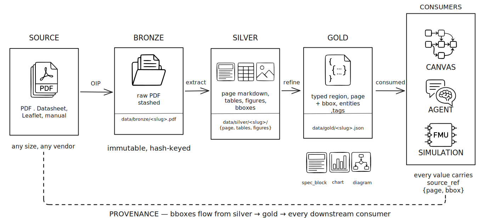

# Data model & events

## The workspace aggregate

A **workspace** is the entire state of one canvas. In code it's a
pydantic model with three fields:

```python
class Workspace:
    meta: WorkspaceMeta        # slug, title, created_at, version
    nodes: dict[str, Node]     # id → Node
    edges: dict[str, Edge]     # id → Edge
```

A `Node` carries `id`, `node_type`, `label`, `x`, `y`, `width?`,
`height?`, `parent?`, and a free-form `data` dict that extensions use
for type-specific payload (e.g. `pdf:document` nodes put `slug` and
`page_count` in there).

An `Edge` carries `id`, `source` (node id), `target` (node id), `label`,
`edge_type` (`floating` or `anchored`), and `data`.

There is **no list view** of all workspaces in memory. Workspaces are
loaded on demand from disk and held only while a request is in flight
or an SSE subscriber is listening.

## Events are the canon

Every mutation produces a `DomainEvent`. The state on disk is *derived*
from the event log; the event log is the truth.

```python
class DomainEvent:
    id: str               # client-supplied UUID, idempotency key
    ts: float             # server-assigned timestamp
    version: int          # monotonic per-workspace counter
    workspace_id: str
    type: str             # "NodeAdded", "EdgeRemoved", ...
    payload: dict         # the event-specific fields
    causation_id: str | None   # for cascade tracing
```

The canvas defines 11 event types, all in `core/events/canvas.py`:

| Event              | When                                        | Cascades?                       |
| ------------------ | ------------------------------------------- | ------------------------------- |
| `NodeAdded`        | new node created                            | no                              |
| `NodeRemoved`      | node deleted                                | yes — to `EdgeRemoved` for every touching edge |
| `NodeMoved`        | drag finished                               | no                              |
| `NodeResized`      | resize handle released                      | no                              |
| `NodeUpdated`      | label/data changed                          | no                              |
| `NodeReparented`   | dropped into / out of an `area`             | no                              |
| `EdgeAdded`        | new edge connected                          | no                              |
| `EdgeRemoved`      | edge deleted (or cascaded from node remove) | no                              |
| `EdgeUpdated`      | edge label / data changed                   | no                              |
| `CanvasCleared`    | bulk wipe                                   | implicit — all nodes/edges gone |
| `CanvasSnapshot`   | replay checkpoint                           | no — informational              |

Extensions add their own event types (`DocBronzed`, `DocSilvered`,
`DocPolished`, `IngestProgress`, `FmuUploaded`, `SimulationCompleted`)
on the same bus, in the extension's own namespace.

## The mutation pipeline

Every command — whether from a browser, an MCP-speaking agent, or the
CLI — goes through the same six steps:

```
[client command]
       │
       ▼  acquire per-workspace asyncio.Lock
[load Workspace from store]
       │
       ▼
[validate command]   ← invariants: edge endpoints exist,
       │               parent exists, idempotent on duplicate id,
       │               row-level evidence edges require source_ref
       ▼
[apply event]        ← pure reducer: (state, event) → new_state
       │               (also: cascade events for cascading commands)
       ▼
[append_event to store]   ← events.jsonl + atomic snapshot.json
       │                    version is now N+1
       ▼
[publish to event bus]    ← MemoryEventBus, in-process pub-sub
       │
       ▼
[return (state, event)]
```

The same flow drives the SSE stream and the MCP `notifications/resources/updated`
ping. There is no second "send the event to subscribers" step — the bus
*is* the dispatch.

The lock keeps mutations on one workspace serialised; different
workspaces proceed in parallel. Extensions emit their own events
(`DocBronzed`, `IngestProgress`, `SimulationCompleted`) on the same
bus.

## Document ingestion pipeline

The PDF extension stores the original source before deriving structured
content and source-grounded regions for use by canvases, agents, and
simulations.



*Source files move through bronze, silver, and gold artefacts; every
downstream consumer receives values with source provenance.*

## Real-time sync as a side effect

The frontend uses `EventSource` against
`GET /api/workspaces/{slug}/events`. The server immediately writes a
`snapshot` event with the full state at the current `version`, then
forwards every new `DomainEvent` as a `patch` event.

The browser-side store (`canvasStore.ts`, Zustand) pattern-matches on
`event.type` and updates its `nodes[id]` / `edges[id]` dictionary.
ReactFlow re-renders only the changed node thanks to dict keys.

If the client detects a version gap (network blip, sleep/wake), it
re-fetches the snapshot via `GET /api/workspaces/{slug}/state` and
resumes streaming. The reconnection is invisible to the user.

**Optimistic local writes** work on top of this. Drag a node → the
store updates `nodes[id].x/y` immediately and renders the next frame;
in parallel, the browser PATCHes `/api/workspaces/{slug}/nodes/{id}`;
the server emits `NodeMoved`; SSE delivers it back; the store's
`applyEvent` runs idempotently because the event id matches a request
the client already issued. On 4xx/5xx the optimistic write is rolled
back and a toast surfaces the error.

## Idempotency, ordering, replay

- **Idempotent.** Every event carries a client-generated `id`. Re-sent
  events are dropped by the store. Crashed-during-write requests are
  safely retryable.
- **Ordered per workspace.** A per-workspace `asyncio.Lock` serialises
  the validate→apply→append→publish path; `version` increments by
  exactly 1 per accepted event. Different workspaces proceed in
  parallel.
- **Replayable.** `events.jsonl` is append-only. `snapshot.json` is a
  cached fold over those events at a known version. Cold-boot the
  process, replay events from the snapshot's version onward, and you
  have the same state.

## What the SSE stream carries

The stream is small and predictable:

```
event: snapshot
data: {"meta": {...}, "nodes": {...}, "edges": {...}, "version": 42}

event: patch
data: {"id": "...", "type": "NodeMoved", "version": 43, "payload": {"id": "n1", "x": 120, "y": 80}, ...}

event: patch
data: {"id": "...", "type": "EdgeAdded", "version": 44, ...}
```

This is what makes the system **agent-friendly**. An MCP client doesn't
need a special "agent protocol" — it subscribes to the same SSE feed
the browser uses, or it polls `canvas_get_state`. Two-way sync between
a human dragging on a canvas and an agent making tool calls is just
both parties speaking to the same `WorkspaceService` and listening to
the same bus.
