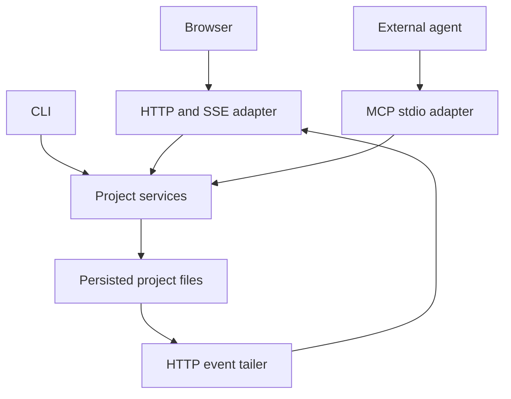

# Interfaces to one project

ANCHOR provides a browser, CLI, HTTP API, and local MCP server. Each uses the
same project models and file-backed storage. Choose the interface that suits
the work without making a separate copy of the canvas.

| Interface | Use it for | How it connects |
| --- | --- | --- |
| Browser | Arrange objects, view PDFs, edit tables, submit markup, and review suggestions | HTTP writes and SSE updates from `anchor serve` |
| CLI | Setup, ingestion, inspection, scripting, and diagnostics | `anchor` commands invoking project services |
| MCP agent | Retrieve evidence and propose or perform authorized canvas work | A client launches `anchor-mcp` over stdio |
| HTTP API | Integrations using project operations | Routes on the running canvas server |

The service box represents common implementations. Independently launched
adapters have separate runtime instances. The HTTP event tailer forwards persisted
canvas changes to browser SSE subscribers. Write locks and in-memory event buses
are process-local, so separate writers should not mutate the same canvas at once.

## Select the same project

One browser server serves one project. `anchor serve --env study --project
pump-study` makes that selection explicit. CLI commands can resolve a working
folder's `anchor.toml`, use a saved `anchor use` selection, or accept explicit
flags where supported.

A named MCP server serves one environment. The agent chooses a project through
`open_project` or a `project` argument. `anchor use` does not change an MCP
session. See [Environments and projects](../guides/environments-and-projects.md).

## Collaboration needs an external agent

The browser can submit an intent with text and drawings. A connected harness
must retrieve it, ask any clarification questions, and return suggestions or
results. The application does not run a model or agent merely because a browser
is open. Configure the provider and connect your client through
[Agent setup](../guides/agent-setup.md).

Source references and persisted intents let humans and agents inspect the same
work artifact. A source dock displays the PDF evidence; an intent thread holds
the request and review decisions. See the [tutorial](../getting-started/tutorial.md).

## Integration limits

The shipped MCP transport is local stdio. The HTTP server has no built-in
authentication and is intended for loopback use. An authenticated remote agent
endpoint, voice interface, XR client, or external notification monitor would
require additional integration; these are not shipped interfaces.
