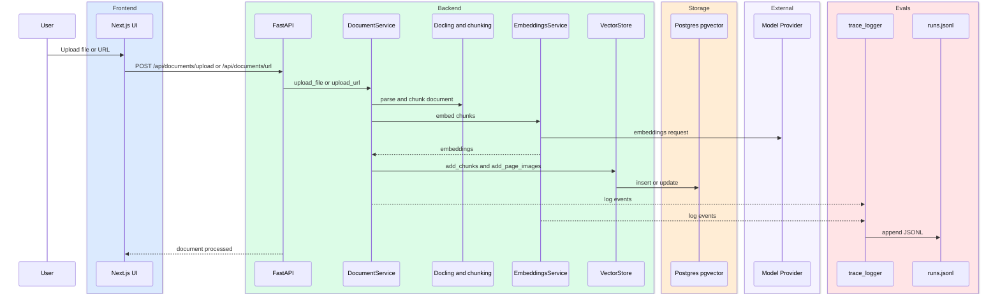
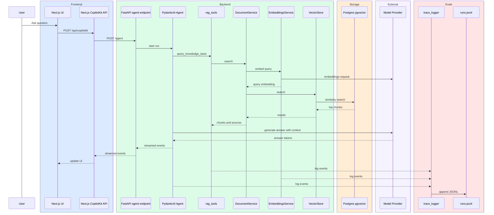

## Flow Diagram

```mermaid
flowchart LR
  %% Minimal syntax for broad Mermaid compatibility (VS Code + older Mermaid).
  %% Labels/paths are kept on edges to avoid parser issues.

  %% Styling
  classDef user fill:#ffffff,stroke:#374151,stroke-width:1px,color:#111827;
  classDef ui fill:#dbeafe,stroke:#2563eb,stroke-width:2px,color:#0f172a;
  classDef api fill:#dcfce7,stroke:#16a34a,stroke-width:2px,color:#052e16;
  classDef svc fill:#ecfccb,stroke:#65a30d,stroke-width:2px,color:#1a2e05;
  classDef store fill:#ffedd5,stroke:#f97316,stroke-width:2px,color:#431407;
  classDef external fill:#f5f3ff,stroke:#7c3aed,stroke-width:2px,color:#2e1065;
  classDef trace fill:#ffe4e6,stroke:#e11d48,stroke-width:2px,color:#4c0519;

  U[User] --> UI_DOCS[Document UI]
  U --> UI_CHAT[Chat UI]

  %% Ingestion (REST)
  UI_DOCS -->|POST /api/documents/upload| API_UPLOAD[Upload API]
  UI_DOCS -->|POST /api/documents/url| API_URL[URL API]
  API_UPLOAD --> DOC_SVC[DocumentService]
  API_URL --> DOC_SVC
  DOC_SVC -->|save file| FILES[uploads/]
  DOC_SVC --> PARSE[Docling + chunking]
  DOC_SVC -->|embed chunks| EMB[EmbeddingsService]
  EMB -->|embeddings| LLM[Model Provider]
  DOC_SVC -->|store chunks/images| VEC[VectorStore]
  VEC -->|INSERT/UPDATE| PG[Postgres + pgvector]

  %% Chat (CopilotKit -> AG-UI agent)
  UI_CHAT -->|POST /api/copilotkit| API_COPILOTKIT[Next.js CopilotKit API]
  API_COPILOTKIT -->|POST /agent| AGENT_EP[FastAPI AG-UI endpoint]
  AGENT_EP --> AGENT[PydanticAI Agent]
  AGENT -->|tool: query_knowledge_base| TOOLS[rag_tools.py]
  TOOLS -->|DocumentService.search| DOC_SVC
  DOC_SVC -->|embed query| EMB
  DOC_SVC -->|VectorStore.search| VEC
  AGENT -->|generate| LLM
  AGENT_EP -->|stream events| API_COPILOTKIT

  %% Evals/tracing (JSONL)
  TOOLS -.-> TRACE[trace_logger.py]
  EMB -.-> TRACE
  AGENT -.-> TRACE
  TRACE --> RUNS[backend/evals/logs/runs.jsonl]

  %% Classes
  class U user;
  class UI_DOCS,UI_CHAT ui;
  class API_UPLOAD,API_URL,API_COPILOTKIT,AGENT_EP api;
  class DOC_SVC,PARSE,EMB,VEC,AGENT,TOOLS svc;
  class FILES,PG store;
  class LLM external;
  class TRACE,RUNS trace;
```

## Sequence Diagrams

### Document Ingestion

```mermaid
sequenceDiagram
  participant User
  box rgb(219,234,254) Frontend
    participant UI as Next.js UI
  end
  box rgb(220,252,231) Backend
    participant API as FastAPI
    participant DS as DocumentService
    participant Parse as Docling and chunking
    participant Emb as EmbeddingsService
    participant VS as VectorStore
  end
  box rgb(255,237,213) Storage
    participant PG as Postgres pgvector
  end
  box rgb(245,243,255) External
    participant LLM as Model Provider
  end
  box rgb(255,228,230) Evals
    participant Trace as trace_logger
    participant Runs as runs.jsonl
  end

  User->>UI: Upload file or URL
  UI->>API: POST /api/documents/upload or /api/documents/url
  API->>DS: upload_file or upload_url
  DS->>Parse: parse and chunk document
  DS->>Emb: embed chunks
  Emb->>LLM: embeddings request
  Emb-->>DS: embeddings
  DS->>VS: add_chunks and add_page_images
  VS->>PG: insert or update

  DS-->>Trace: log events
  Emb-->>Trace: log events
  Trace->>Runs: append JSONL
  API-->>UI: document processed
```

### Chat Retrieval

```mermaid
sequenceDiagram
  participant User
  box rgb(219,234,254) Frontend
    participant UI as Next.js UI
    participant Cop as Next.js CopilotKit API
  end
  box rgb(220,252,231) Backend
    participant AgentEP as FastAPI agent endpoint
    participant Agent as PydanticAI Agent
    participant Tools as rag_tools
    participant DS as DocumentService
    participant Emb as EmbeddingsService
    participant VS as VectorStore
  end
  box rgb(255,237,213) Storage
    participant PG as Postgres pgvector
  end
  box rgb(245,243,255) External
    participant LLM as Model Provider
  end
  box rgb(255,228,230) Evals
    participant Trace as trace_logger
    participant Runs as runs.jsonl
  end

  User->>UI: Ask question
  UI->>Cop: POST /api/copilotkit
  Cop->>AgentEP: POST /agent
  AgentEP->>Agent: start run
  Agent->>Tools: query_knowledge_base
  Tools->>DS: search
  DS->>Emb: embed query
  Emb->>LLM: embeddings request
  Emb-->>DS: query embedding
  DS->>VS: search
  VS->>PG: similarity search
  PG-->>VS: top chunks
  VS-->>DS: results
  DS-->>Tools: chunks and sources
  Agent->>LLM: generate answer with context
  LLM-->>Agent: answer tokens
  Agent-->>AgentEP: streamed events
  AgentEP-->>Cop: streamed events
  Cop-->>UI: update UI

  Tools-->>Trace: log events
  Emb-->>Trace: log events
  Agent-->>Trace: log events
  Trace->>Runs: append JSONL
```
