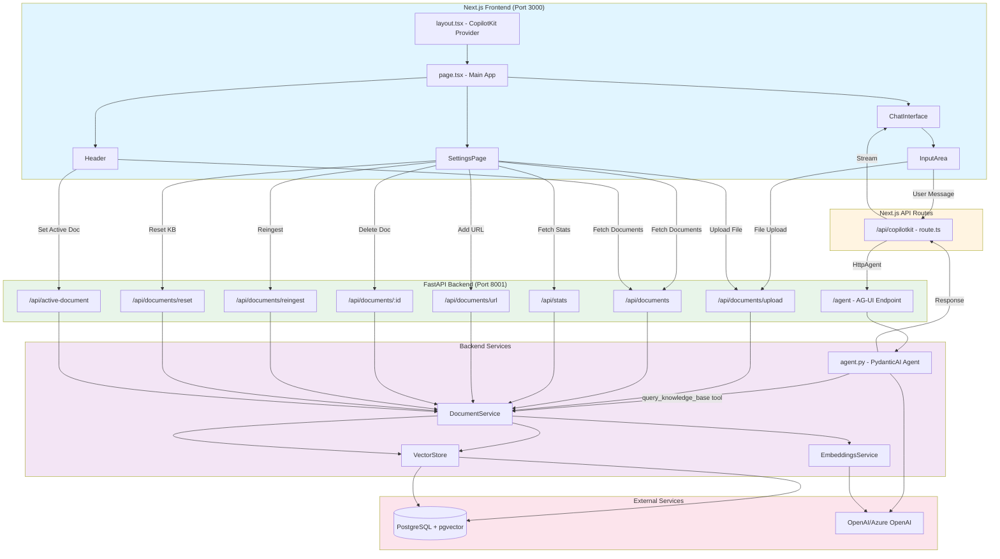

# Frontend-Backend Workflow

## Mermaid Diagram



## Detailed Workflows

### 1. Chat/Conversation Flow

**Path**: User Input → CopilotKit → Next.js API → Backend Agent → Response

```
User types message in InputArea
  ↓
ChatInterface.handleSendMessage()
  ↓
CopilotKit.appendMessage() (via useCopilotChat hook)
  ↓
CopilotKit runtime → POST /api/copilotkit
  ↓
Next.js: /api/copilotkit/route.ts
  ├─ CopilotRuntime with HttpAgent
  └─ HttpAgent → http://localhost:8001/agent
      ↓
Backend: /agent (AG-UI endpoint)
  ↓
agent.py: PydanticAI Agent
  ├─ System Prompt
  ├─ Model: OpenAIResponsesModel
  └─ Tools:
      └─ query_knowledge_base(query, top_k)
          ↓
          DocumentService.search()
          ↓
          VectorStore.search() → PostgreSQL
          ↓
          Returns chunks + sources
  ↓
Agent generates response with RAG context
  ↓
Response streamed back through CopilotKit
  ↓
ChatInterface displays message
```

### 2. Document Upload Flow (from Chat InputArea)

**Path**: File Selection → Direct Backend API → Processing

```
User selects file in InputArea
  ↓
InputArea.handleFileSelect()
  ↓
POST http://localhost:8001/api/documents/upload
  (FormData with file)
  ↓
Backend: /api/documents/upload
  ↓
DocumentService.upload_file()
  ├─ Save to uploads/ directory
  ├─ Generate document ID (MD5 hash)
  ├─ Register in PostgreSQL (documents table)
  └─ process_document()
      ├─ DoclingConverter → Markdown
      ├─ MarkdownFormatter → Chunks
      ├─ EmbeddingsService → Embeddings
      └─ VectorStore.add_chunks() → PostgreSQL
  ↓
Response: { success: true, document: {...} }
  ↓
InputArea shows upload status
```

### 3. Settings Page Flows

**Document Management:**
- **List Documents**: `GET /api/documents` → Returns all documents
- **Upload File**: `POST /api/documents/upload` → Same as InputArea flow
- **Add URL**: `POST /api/documents/url` → Fetches URL, processes like file
- **Delete Document**: `DELETE /api/documents/:id` → Removes doc + chunks
- **Reingest All**: `POST /api/documents/reingest` → Re-processes all docs
- **Reset KB**: `DELETE /api/documents/reset` → Clears all data
- **Get Stats**: `GET /api/stats` → Returns document/chunk counts

**Active Document Filter:**
- **Set Active**: `POST /api/active-document?document_id=xxx` → Sets global filter
- Used by agent's `query_knowledge_base` tool to filter searches

### 4. Header Component Flow

```
Header mounts
  ↓
useEffect: Fetch documents every 30s
  GET /api/documents
  ↓
User selects document from dropdown
  ↓
POST /api/active-document?document_id=xxx
  ↓
Sets _active_document_id in backend
  ↓
Future RAG queries filtered by this document
```

## API Endpoint Summary

### Frontend → Backend Direct Calls

| Component | Endpoint | Method | Purpose |
|-----------|----------|--------|---------|
| InputArea | `/api/documents/upload` | POST | Upload file from chat |
| SettingsPage | `/api/documents` | GET | List documents |
| SettingsPage | `/api/stats` | GET | Get KB statistics |
| SettingsPage | `/api/documents/upload` | POST | Upload file |
| SettingsPage | `/api/documents/url` | POST | Add URL |
| SettingsPage | `/api/documents/:id` | DELETE | Delete document |
| SettingsPage | `/api/documents/reingest` | POST | Re-process all |
| SettingsPage | `/api/documents/reset` | DELETE | Clear KB |
| Header | `/api/documents` | GET | List documents |
| Header | `/api/active-document` | POST | Set active filter |

### Frontend → Next.js API → Backend

| Component | Next.js Route | Backend Endpoint | Purpose |
|-----------|---------------|------------------|---------|
| ChatInterface | `/api/copilotkit` | `/agent` | Chat conversation |

## Key Technologies

- **Frontend**: Next.js 14 (App Router), React, CopilotKit
- **Next.js API**: CopilotRuntime, HttpAgent from @ag-ui/client
- **Backend**: FastAPI, PydanticAI, AG-UI
- **Storage**: PostgreSQL + pgvector
- **AI**: OpenAI/Azure OpenAI (embeddings + LLM)

## Environment Variables

- `NEXT_PUBLIC_BACKEND_URL`: Backend URL (default: http://localhost:8001)
- Backend uses `.env` for database, OpenAI, and other configs

