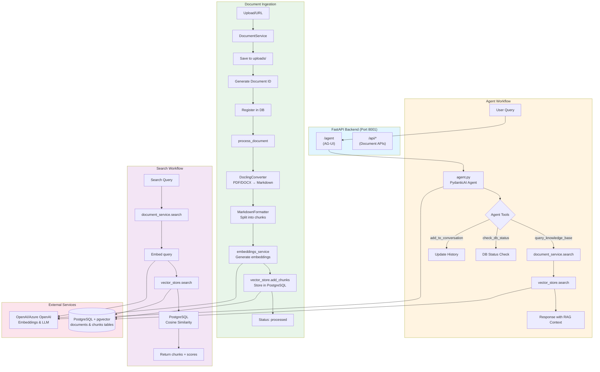

# Backend workflow diagram:

## Mermaid Diagram

**Key Components:**

1. **FastAPI App** (`main.py`): Entry point, mounts AG-UI agent and exposes REST APIs
2. **Agent** (`agent.py`): PydanticAI agent with tools for RAG queries
3. **DocumentService** (`document_service.py`): Orchestrates document processing pipeline
4. **VectorStore** (`vector_store.py`): Manages PostgreSQL + pgvector for embeddings
5. **EmbeddingsService** (`embeddings.py`): Generates embeddings via OpenAI/Azure
6. **DoclingConverter** (`docling_processing/`): Converts PDFs/DOCX to markdown

**Data Flow Summary:**
- **Ingestion**: File/URL → Docling → Chunking → Embedding → PostgreSQL
- **Query**: User question → Agent → Tool call → Vector search → Context → LLM → Response
- **Storage**: PostgreSQL with pgvector extension for similarity search

The agent uses the `query_knowledge_base` tool during conversations to retrieve relevant context from the vector store before generating responses.
