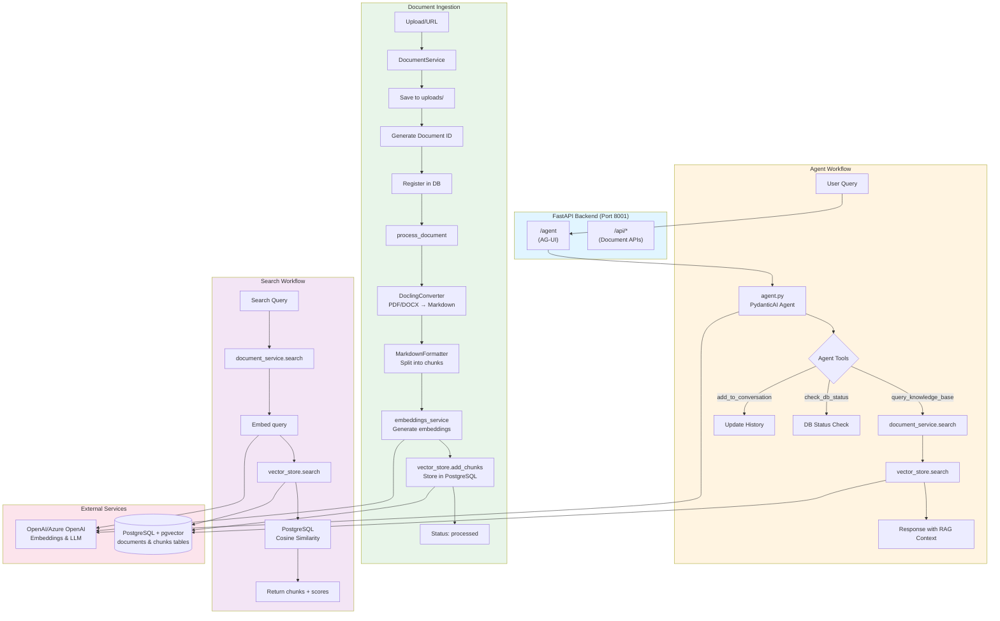

# Backend workflow diagram:

## Mermaid Diagram



## ASCII Diagram

```
┌─────────────────────────────────────────────────────────────────────────┐
│                         FASTAPI BACKEND (main.py)                       │
│                         Port: 8001                                      │
└─────────────────────────────────────────────────────────────────────────┘
                                    │
                    ┌───────────────┴───────────────┐
                    │                               │
            ┌───────▼────────┐            ┌─────────▼──────────┐
            │  AG-UI Agent   │            │  Document APIs     │
            │  (/agent)      │            │  (/api/*)          │
            └───────┬────────┘            └─────────┬──────────┘
                    │                               │
                    │                               │
┌───────────────────▼───────────────────────────────────────────────────────┐
│                                                                           │
│  ┌─────────────────────────────────────────────────────────────────┐   │
│  │                    AGENT WORKFLOW                                │   │
│  └─────────────────────────────────────────────────────────────────┘   │
│                                                                           │
│  1. User Query → /agent (AG-UI endpoint)                                 │
│     │                                                                     │
│     ├─→ agent.py: PydanticAI Agent                                       │
│     │   ├─ System Prompt (SYSTEM_PROMPT)                                 │
│     │   ├─ Model: OpenAIResponsesModel (via model.py)                   │
│     │   └─ State: RAGState (conversation_history, current_sources)      │
│     │                                                                     │
│     ├─→ Agent Tools Available:                                           │
│     │   ├─ query_knowledge_base(query, top_k)                            │
│     │   │   └─→ document_service.search()                                │
│     │   │       └─→ vector_store.search()                                 │
│     │   │                                                                 │
│     │   ├─ check_db_status()                                             │
│     │   └─ add_to_conversation(role, content)                            │
│     │                                                                     │
│     └─→ Response with RAG context → Frontend                             │
│                                                                           │
│  ┌─────────────────────────────────────────────────────────────────┐   │
│  │                 DOCUMENT INGESTION WORKFLOW                     │   │
│  └─────────────────────────────────────────────────────────────────┘   │
│                                                                           │
│  2. Document Upload/URL → /api/documents/upload or /api/documents/url   │
│     │                                                                     │
│     ├─→ document_service.py: DocumentService                             │
│     │   │                                                                 │
│     │   ├─ Step 1: Save File                                             │
│     │   │   └─→ Save to uploads/ directory                               │
│     │   │                                                                 │
│     │   ├─ Step 2: Generate Document ID                                  │
│     │   │   └─→ MD5 hash of filename + content                            │
│     │   │                                                                 │
│     │   ├─ Step 3: Register in Database                                 │
│     │   │   └─→ vector_store.add_document()                              │
│     │   │       └─→ PostgreSQL: INSERT INTO documents                    │
│     │   │                                                                 │
│     │   └─ Step 4: Process Document                                     │
│     │       │                                                             │
│     │       ├─→ process_document(document_id)                             │
│     │       │   │                                                         │
│     │       │   ├─→ DoclingConverter.convert_document()                  │
│     │       │   │   └─→ Converts PDF/DOCX → Markdown                     │
│     │       │   │                                                         │
│     │       │   ├─→ MarkdownFormatter.create_chunks()                    │
│     │       │   │   └─→ Split into chunks (size: 512 tokens)             │
│     │       │   │                                                         │
│     │       │   ├─→ embeddings_service.embed_texts()                     │
│     │       │   │   └─→ OpenAI/Azure OpenAI API                           │
│     │       │   │       └─→ text-embedding-ada-002 or 3-large             │
│     │       │   │                                                         │
│     │       │   └─→ vector_store.add_chunks()                             │
│     │       │       └─→ PostgreSQL: INSERT INTO chunks                    │
│     │       │           └─→ Stores: content + embedding vector            │
│     │       │                                                             │
│     │       └─→ Update document status: 'processed'                       │
│                                                                           │
│  ┌─────────────────────────────────────────────────────────────────┐   │
│  │                    SEARCH WORKFLOW                              │   │
│  └─────────────────────────────────────────────────────────────────┘   │
│                                                                           │
│  3. Search Query → /api/search                                          │
│     │                                                                     │
│     ├─→ document_service.search(query, top_k, document_id?)             │
│     │   │                                                                 │
│     │   ├─→ embeddings_service.embed_text(query)                         │
│     │   │   └─→ Generate query embedding                                 │
│     │   │                                                                 │
│     │   └─→ vector_store.search(query_embedding, top_k, document_id)    │
│     │       │                                                             │
│     │       └─→ PostgreSQL Query:                                         │
│     │           SELECT content, filename, similarity                      │
│     │           FROM chunks c                                             │
│     │           JOIN documents d ON c.document_id = d.document_id        │
│     │           WHERE 1 - (c.embedding <=> query_embedding) > threshold  │
│     │           ORDER BY c.embedding <=> query_embedding                  │
│     │           LIMIT top_k                                               │
│     │           └─→ Returns: chunks with similarity scores               │
│                                                                           │
│  ┌─────────────────────────────────────────────────────────────────┐   │
│  │              OTHER API ENDPOINTS                                │   │
│  └─────────────────────────────────────────────────────────────────┘   │
│                                                                           │
│  • GET  /api/documents          → List all documents                    │
│  • DELETE /api/documents/{id}   → Delete document + chunks              │
│  • POST /api/documents/reingest → Re-process all documents              │
│  • DELETE /api/documents/reset → Clear entire knowledge base            │
│  • GET  /api/stats              → Get KB statistics                     │
│  • GET/POST /api/active-document → Set/get active document filter      │
│  • GET  /health                 → Health check                          │
│                                                                           │
└───────────────────────────────────────────────────────────────────────────┘
                                    │
                                    │
                    ┌───────────────┴───────────────┐
                    │                               │
        ┌───────────▼──────────┐        ┌──────────▼──────────┐
        │   PostgreSQL +       │        │   OpenAI/Azure      │
        │   pgvector           │        │   OpenAI API         │
        │                      │        │                      │
        │ • documents table    │        │ • Embeddings         │
        │ • chunks table       │        │ • LLM (via agent)    │
        │   (with vector)      │        │                      │
        │ • HNSW index         │        │                      │
        └──────────────────────┘        └──────────────────────┘
```

**Key Components:**

1. **FastAPI App** (`main.py`): Entry point, mounts AG-UI agent and exposes REST APIs
2. **Agent** (`agent.py`): PydanticAI agent with tools for RAG queries
3. **DocumentService** (`document_service.py`): Orchestrates document processing pipeline
4. **VectorStore** (`vector_store.py`): Manages PostgreSQL + pgvector for embeddings
5. **EmbeddingsService** (`embeddings.py`): Generates embeddings via OpenAI/Azure
6. **DoclingConverter** (`docling_processing/`): Converts PDFs/DOCX to markdown

**Data Flow Summary:**
- **Ingestion**: File/URL → Docling → Chunking → Embedding → PostgreSQL
- **Query**: User question → Agent → Tool call → Vector search → Context → LLM → Response
- **Storage**: PostgreSQL with pgvector extension for similarity search

The agent uses the `query_knowledge_base` tool during conversations to retrieve relevant context from the vector store before generating responses.